# DriveGuard

Real-time driver drowsiness and distraction detection on a webcam and an
ESP32.

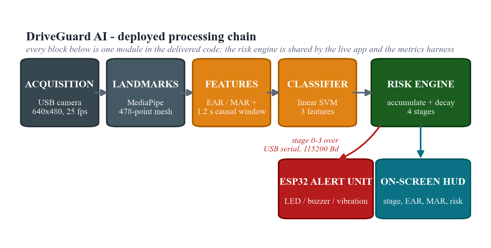

**95.0%** accuracy leave-one-person-out · **7.5 ms** per frame on a laptop CPU
· **2.40 s** median alert latency · runs on ~US$45 of hardware

---

## What it does

A webcam watches the driver. Eye and mouth aspect ratios are computed from a
478-point face mesh, summarised over a **1.2-second causal window**, and
classified as *normal*, *drowsy* or *yawning*. A separate object detector
handles phone use, which facial geometry cannot represent.

Events do not trigger alerts directly. They feed a **risk accumulator** in
units of seconds-of-evidence, which decays when the driver is alert and
escalates through four stages driven on an ESP32:

| stage | threshold | output |
|---|---|---|
| 0 NORMAL | – | green LED |
| 1 DROWSY | 1.5 s | amber + chirp |
| 2 FATIGUE | 4.0 s | amber blink + double beep |
| 3 CRITICAL | 7.5 s | red blink + siren |

A single blink cannot trigger an alarm; only sustained closure can.

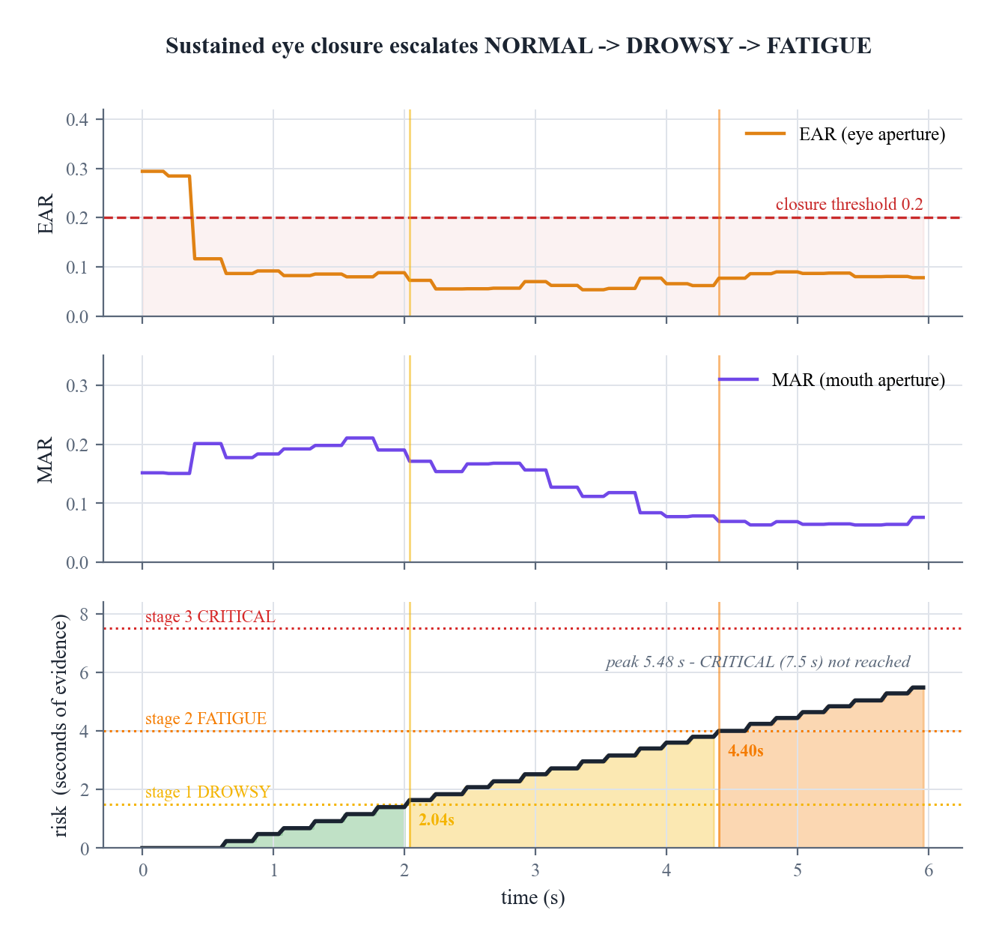

### The two measurements everything rests on

Both are dimensionless ratios of landmark distances, so they are invariant to
how far the driver sits from the camera:

```
        ||p2 - p6|| + ||p3 - p5||                    vertical lip separation
EAR  =  ─────────────────────────          MAR  =  ─────────────────────────
              2 · ||p1 - p4||                       horizontal lip separation
```

EAR falls sharply when an eye closes; MAR rises during a yawn. A single frame
cannot tell a blink from the onset of sleep, so each frame is described by
statistics over a **trailing** window of six samples at 5 Hz. The window is
strictly causal - it contains no future frame, because a deployed system
cannot see the future. That property is enforced by a test, not by inspection:
perturbing frame *j+1* must leave the output for frame *j* bit-identical.

The 1.2 s length is measured, not assumed. Accuracy climbs steeply to it and
decays slowly after: shorter windows cannot separate a blink from a microsleep,
longer ones blur the onset the alert depends on.

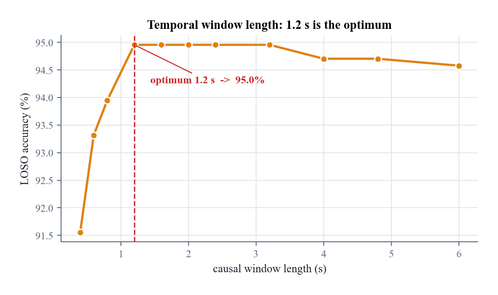

### Three features, chosen by ablation

Ten feature subsets were evaluated. Accuracy **peaks at three** and falls as
more are added - on 793 training frames each extra dimension costs more in
variance than it returns in signal.

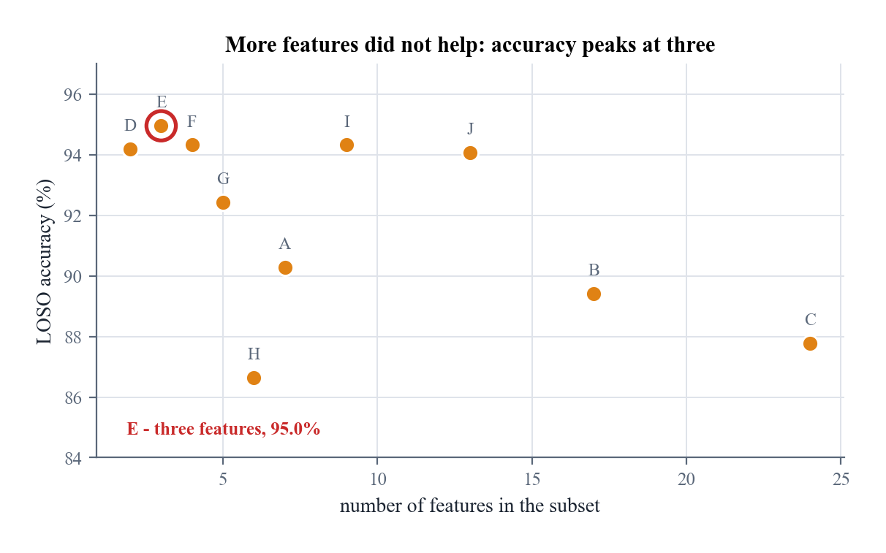

The deployed set is `perclos_20`, `MAR` and `closed_run_w`, fed to a linear
SVM.

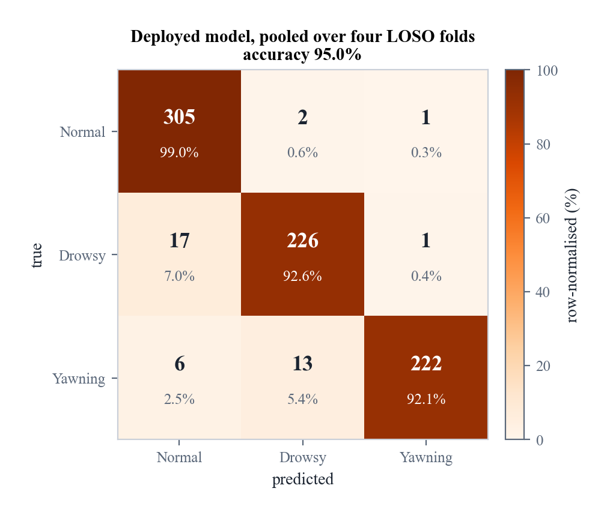

### Phone use needs a second branch

A driver holding a phone to the ear has an entirely normal eye and mouth
configuration, so facial geometry is blind to it - measured F1 **0.498** for
phone against **0.942** for yawning. A zero-shot COCO detector localises the
object instead, at precision **1.000** and recall 0.768, and contributes
0.6 risk-units per second independently of the classifier. It is sampled at
~6 Hz rather than every frame: it costs 38 ms against Branch A's 7.5 ms, and
phone use is a sustained behaviour, not a millisecond event.

---

## Geometry against deep learning

Five CNN variants were trained on **identical frames under identical
leave-one-person-out folds**. Three hand-crafted geometric features beat every
one of them.

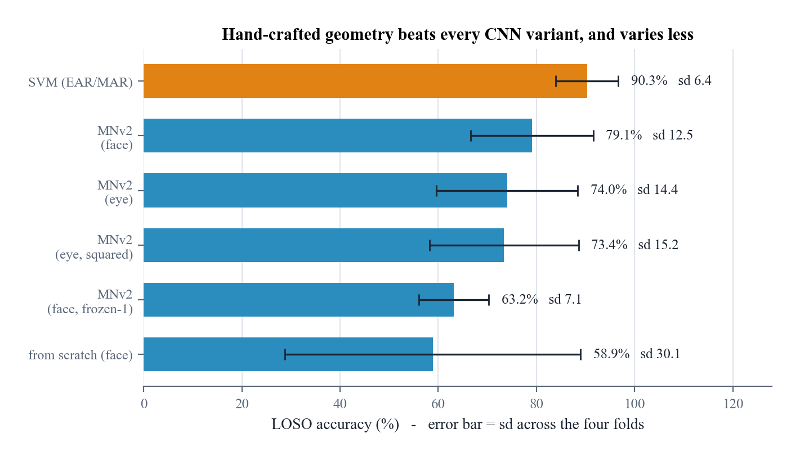

The bar above is per-frame geometry alone (90.3%); adding the 1.2 s causal
window lifts it to the 95.0% quoted elsewhere, so the window is worth 4.7
points on its own.

Broken down by fold, the CNN does not fail uniformly - it collapses on one
particular participant while staying competitive on another. For a system that
must work for whoever sits in the seat, that asymmetry is the deployment risk.

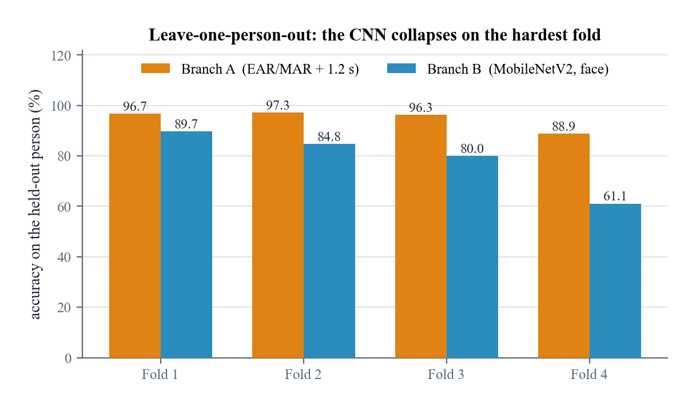

Four experiments were run to overturn that result:

| objection | test | outcome |
|---|---|---|
| the CNN never got temporal context | same 1.2 s window, 3 seeds, 16 nested networks | gap survives, *t* = 3.47 |
| the CNN just needed more data | learning curve: 48 trainings, 4 data fractions | **gap widened** |
| the detector threshold was unfair | swept every confidence from 0.05 up | curves never cross |
| smoothing predictions would help | k = 3 to 11 | every setting was worse |

The learning curve refutes the data-scale explanation. Across a fourfold
increase in data the geometric model gained 1.1 points while the CNN
**fell 10.1**:

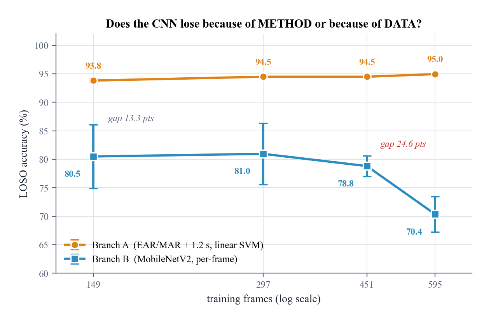

---

## A shortcut in public drowsiness datasets

Two detectors — YOLO11n (NMS) and YOLO26n (NMS-free) — were trained on 11,180
images built from FL3D labels over NITYMED footage. Both score well in-domain
and **both score an F1 of exactly 0.000 on the drowsy class** on independent
footage, at every confidence threshold tested.

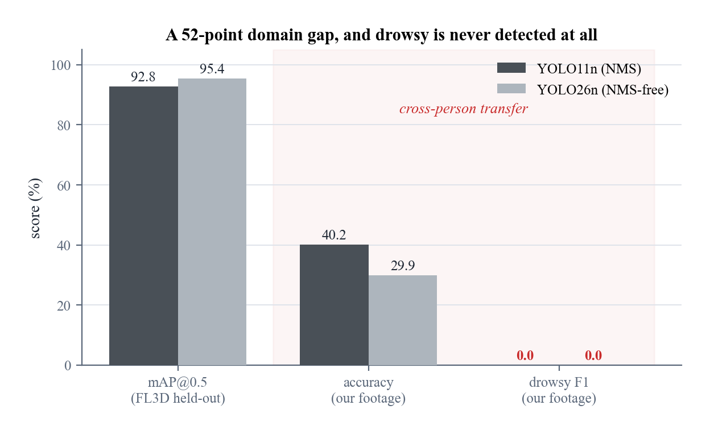

The reason is in the data, not the architecture. In that cohort drivers tilt
their heads when simulating microsleep, so **head pose predicts the label
perfectly within the dataset**. The detectors learned pose, which is free,
instead of eye closure, which is hard. Our participants dozed upright, and the
shortcut evaporated.

Two consequences:

- The model that was **2.6 points better** on the benchmark was **10.3 points
  worse** on transfer. Selecting on benchmark score picks the worse model.
- A geometric ratio of eyelid distances *cannot* substitute head pose for eye
  closure. An end-to-end detector can, and did — an argument for interpretable
  features in safety-critical settings.

---

## Illumination is the limiting factor, and not through darkness

Night-time cost 16.3 points. The obvious explanation — too dark — is wrong.

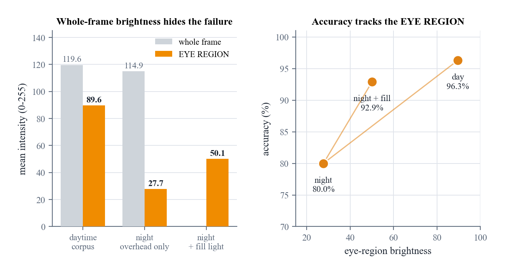

Whole-frame brightness barely moved (119.6 → 114.9) while the **eye region
fell 69%**. Overhead light plus brow and spectacle shadow hides the eyelid
edge that the aspect ratio depends on. Measured closed-eye EAR rises from
0.101 to **0.202** — just above the 0.20 closure threshold, so closures stop
being detected at all.

A frontal fill light recovers **79% of the loss**, taking closed-eye EAR back
to 0.130. The remedy has to be optical: CLAHE, gamma and histogram
equalisation were all tested and all failed, because information the sensor
never captured cannot be restored in post-processing.

---

## Measured system performance

| metric | value | basis |
|---|---|---|
| per-frame latency | **7.5 ms** median | 134 fps sustainable, camera-limited to 25 |
| end-to-end alert latency | **2.40 s** median | 16 event clips |
| false alarms | **23.1 / hour** | 44 unseen external drivers |
| stage-transition accuracy | **100%** | 26 clips, leave-one-person-out |

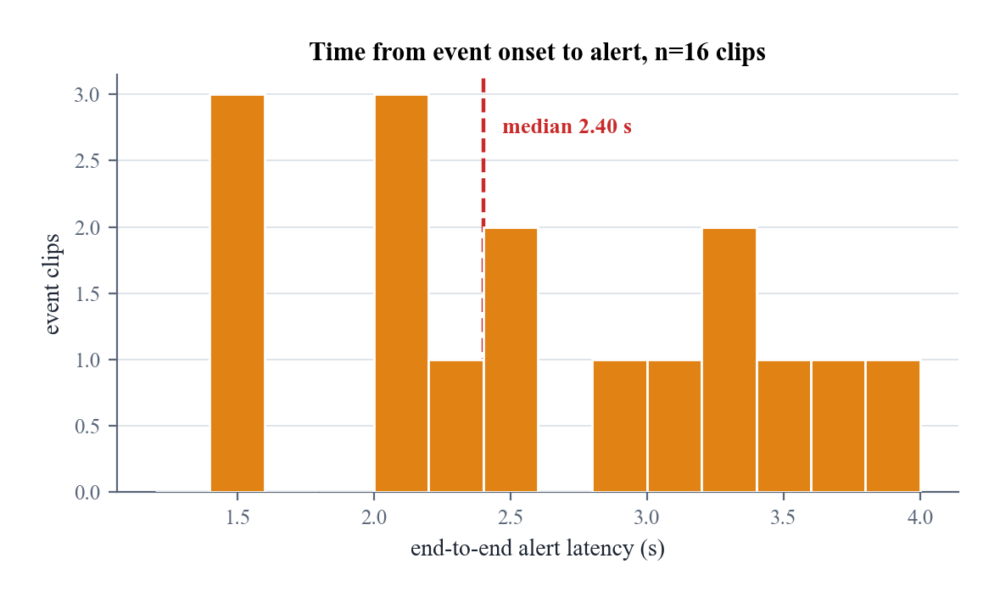

On our own footage the system produced **zero** false alarms - but over only
1.03 minutes of alert driving. By the rule of three that supports a 95% upper
bound of 175/hour, which is useless, so the figure above is measured against
unseen external drivers instead. It is a far worse number, and it is the only
one the evidence supports.

---

## Running it

The fitted Branch A classifier ships in `models/`, so no training and no
dataset are required. One file is not vendored: the MediaPipe face landmark
bundle, which is Google's and is fetched on first use.

```bash
pip install -r requirements.txt
python src/driveguard/fetch_models.py         # face landmark model, 3.6 MB

python src/driveguard/find_camera.py          # which camera index
python src/driveguard/demo_readiness.py       # is the lighting good enough
python src/driveguard/driveguard_live.py      # the system
python src/driveguard/driveguard_live.py --no-serial   # no hardware needed
```

Keys: `q` quit · `r` reset risk · `s` screenshot.

### Hardware

An ESP32 DevKit v1, three LEDs behind series resistors, a buzzer and a
vibration module - about US$45 all in.

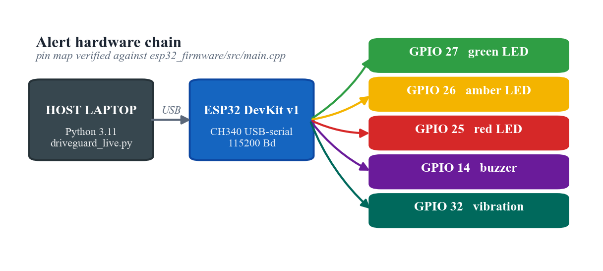

| GPIO | 27 | 26 | 25 | 14 | 32 |
|---|---|---|---|---|---|
| | green | amber | red | buzzer | vibration |

Flash `firmware/` with PlatformIO. The host sends one ASCII character per
stage change at 115200 baud, and `x` to blank the unit on exit.

---

## Repository layout

```
src/driveguard/   the deployed system - engine, live app, serial bridge
src/capture/      recording clips for your own participants
src/features/     EAR / MAR extraction and the causal window
src/training/     both branches and every experiment above
src/detector/     the YOLO track
models/           fitted Branch A classifier (3 KB, no personal data)
results/          the JSON behind every number quoted above
tests/            checks that run without the recordings
firmware/         ESP32 sketch and PlatformIO config
```

To retrain rather than use the shipped model, place your own recordings and
run `src/features/extract_features.py` then `extract_temporal.py`; the engine
falls back to fitting from `features_temporal.npz` whenever it is present.

### Checking the numbers

Every figure above is rendered from a file in `results/`, so nothing here has
to be taken on trust — `branch_a_subsets.json` holds the ten feature subsets,
`system_metrics.json` the latency and false-alarm measurements, and so on. The
per-fold blocks are keyed `P1`–`P4`; the participants are not named anywhere.

The tests need no data at all. They build landmark arrays with the exact EAR
and MAR each case calls for, then assert the two properties the system rests
on: that the accumulator escalates only on sustained evidence, and that the
window is strictly causal — perturbing a later frame cannot change a decision
already made.

```bash
python tests/test_engine.py
```

---

## How it was evaluated

Every figure above is **leave-one-person-out**: the held-out person
contributes no frame to training, to feature scaling, or to model selection.
Consecutive video frames are nearly identical, so a random frame-level split
lets a model score highly by recognising the person rather than the behaviour.

The deployed model was also applied unchanged to **10,531 frames from 44
drivers** it had never seen, scoring 86.1% against a 72.9% majority baseline.

---

## Limitations

- **Four participants.** The 44-driver external test mitigates this; it does
  not remove it. Ten feature subsets were compared on the same folds, so the
  winner's margin is optimistic — the paired gain over baseline is +4.0 points
  with *t* = 1.45, which is **not statistically separable** on four folds. The
  defensible claim is the mechanism, not the decimal.
- **Acted, not physiological, drowsiness.** This captures the visual signature
  of fatigue, not fatigue itself.
- **CRITICAL needs 7.5 s of evidence**, so it does not fire within the
  6-second evaluation clips. It is reachable in continuous operation.
- **The detector branch does not transfer** and is reported here as a negative
  result rather than presented as a working component.

---

## Data

No face data, photographs or footage are published. The evaluation set was
recorded by the authors and consented for private processing only; no image,
landmark, filename or identity from it is contained in the shipped model, which
holds a scaler and 135 support vectors over three aggregate ratios. Every figure
here is generated from the measurements.

The public sources used for pre-training are referenced, not redistributed:

- **FL3D** — frame-level drowsiness labels ·
  [Kaggle](https://www.kaggle.com/datasets/matjazmuc/frame-level-driver-drowsiness-detection-fl3d)
- **NITYMED** — night-time driving videos ·
  [IEEE DataPort](https://ieee-dataport.org/documents/nitymed)

MRL Eye Dataset and YawDD were evaluated and **not used**; the latter has
effectively two subjects, which cannot support person-independent evaluation.

---

## Built on

MediaPipe Face Mesh · scikit-learn · PyTorch · Ultralytics YOLO · OpenCV ·
PlatformIO

## Cite this work

Machine-readable metadata lives in [`CITATION.cff`](CITATION.cff); GitHub renders it as
**Cite this repository** in the sidebar.

```bibtex
@software{abdullahi_driveguard,
  author  = {Abdullahi, Ismail Dayah},
  title   = {{DriveGuard}: geometric features beat {CNNs} for driver drowsiness detection},
  version = {1.0.0},
  year    = {2026},
  url     = {https://github.com/IsmailDayah/driveguard}
}
```

## License

MIT — see [LICENSE](LICENSE).
